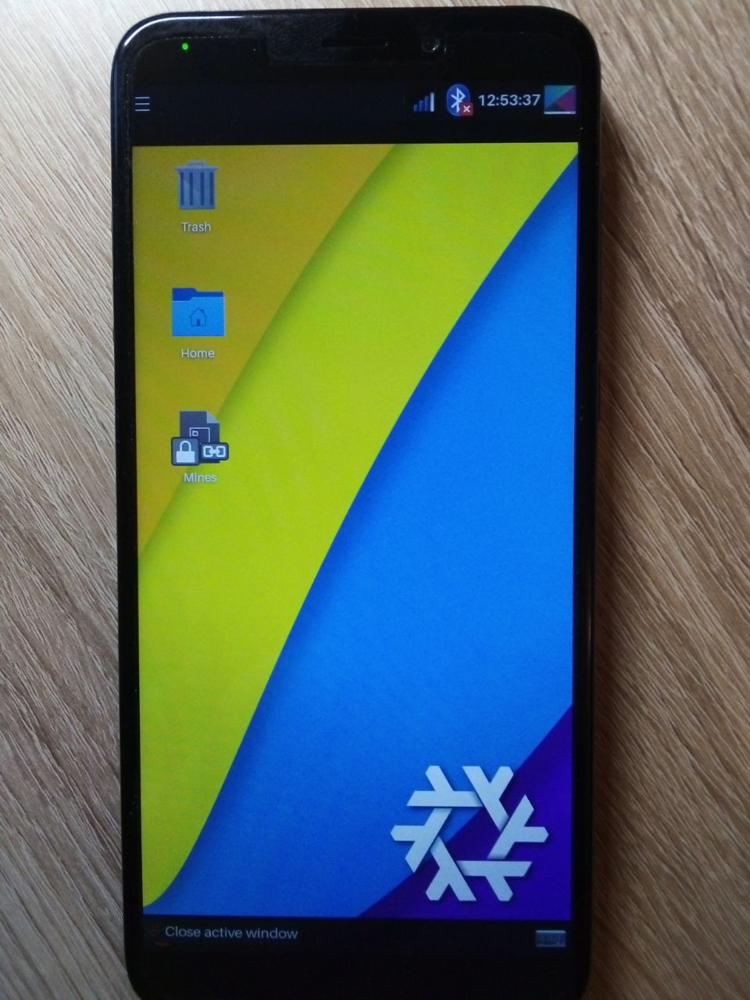
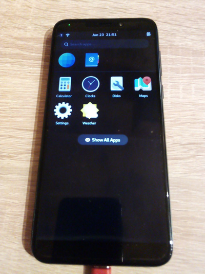
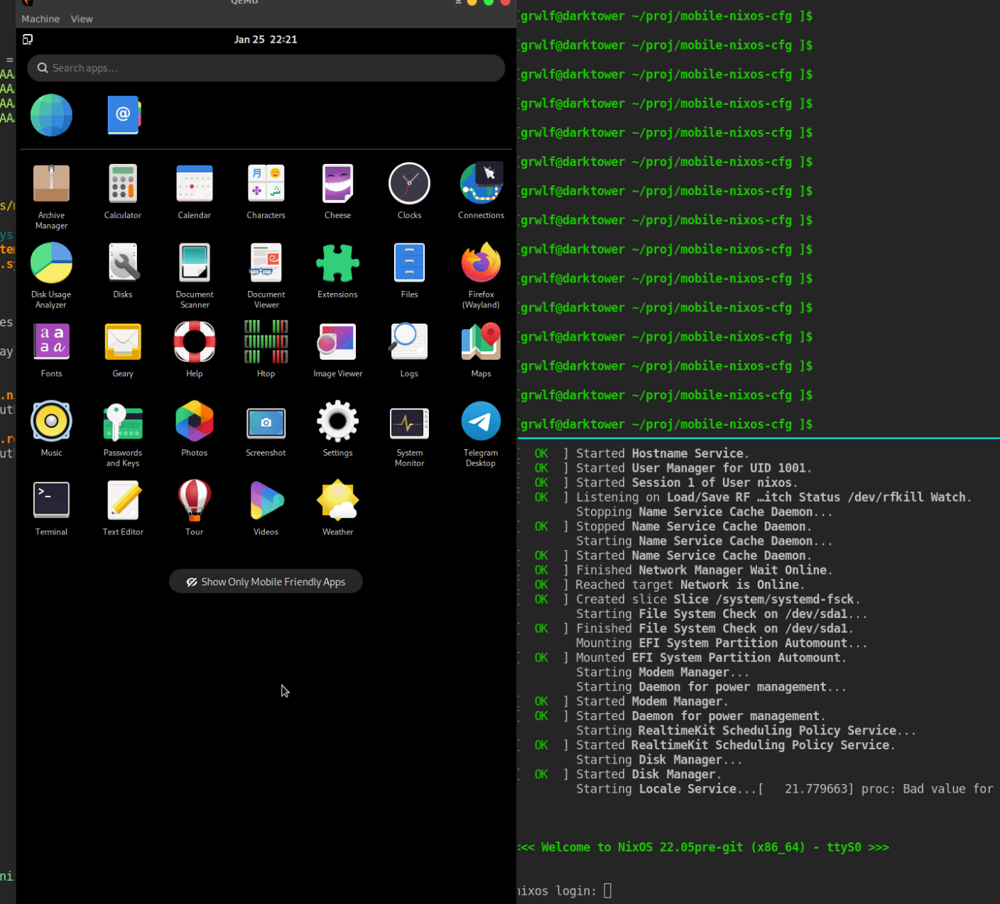

What is it?
-----------

This is an umbrella repo for my [Pinephone](https://www.pine64.org/pinephone/)
and [MobileNixos](https://mobile.nixos.org/index.html) experiemnts. The repo is
a bit oldschoolish as it doesn't use NixFlakes. The dependant repositories
are pinned as Git submodules (use `git clone --recursive ..`).


1. [What is it?](#what-is-it?)
2. [Hardware](#hardware)
3. [Usage](#usage)
   * [How to use this repository](#how-to-use-this-repository)
   * [Flashing external SDcard with Jumpdrive utility](#flashing-external-sdcard-with-jumpdrive-utility)
   * [Flashing the internal eMMC card with a Mobile NixOS example configuration](#flashing-the-internal-emmc-card-with-a-mobile-nixos-example-configuration)
   * [Updating Pinephone over SSH](#updating-pinephone-over-ssh)
   * [Setting up a remote build agent](#setting-up-a-remote-build-agent)
   * [On updating the MobileNixos and Nixpkgs submodules](#on-updating-the-mobilenixos-and-nixpkgs-submodules)
   * [Switching to a Phosh configuration](#switching-to-a-phosh-configuration)
   * [Running applications from the Phosh configuraiton via SSH](#running-applications-from-the-phosh-configuraiton-via-ssh)
   * [Running the Phosh config in a QEMU emulator](#running-the-phosh-config-in-a-qemu-emulator)
   * [Power consumption](#power-consumption)
4. [Notes](#notes)
5. [Resources](#resources)

Hardware
--------

* A [Pinephone](https://www.pine64.org/pinephone/) and a USB cable
* A host PC with the [Nix](https://nixos.org/nix) package manager installed
* 32Gb SDcard and USB cardreader

Usage
-----

### How to use this repository

1. Checkout the Git submodules `(host) $ git submodule update --init`
2. Enter the nix-shell to set the `PATH` and `NIX_PATH` variable: `(host) $
   nix-shell`.

### Flashing external SDcard with Jumpdrive utility

* The original document https://wiki.pine64.org/wiki/PinePhone_Installation_Instructions#Using_JumpDrive
* Jumpdrive page https://github.com/dreemurrs-embedded/Jumpdrive

The algorithm:

1. Insert the TF-sdcard to your cardreader and connect it to the Host PC
2. Run the [flash-jumpdrive.sh](https://github.com/grwlf/mobile-nixos-tools/blob/main/sh/flash-jumpdrive.sh#L1) script `sh
   ./script/flash-jumpdrive.sh`
3. Make sure the script detects the sdcard correctly, press `y`
4. Type in the `sudo` password if set. The sdcard is now the jumpdrive sdcard
5. Move the sdcard from the cardreader to the Pinephone
6. Boot the Pinephone and connect it to the PC with USB cable. eMMC flash will
   appear in the list of Host PC's block devices (verify it with `lsblk`).

Now one can flash the phone's internal eMMC from the Host PC.

### Flashing the internal eMMC card with a Mobile NixOS example configuration

* Tomf blog provided a good set of instructions https://git.sr.ht/~tomf/notes/tree/master/item/pinephone-nixos-getting-started.md
* Aarch64 image issue https://github.com/NixOS/mobile-nixos/issues/373
* On resizing partitions https://github.com/NixOS/mobile-nixos/issues/342
* A status Issue on MobileNixos installer https://github.com/NixOS/mobile-nixos/issues/374

Here we flash the Pinephone with the bootable MobileNixos
configuration [example.nix](https://github.com/grwlf/mobile-nixos-tools/blob/main/nix/example.nix#L1). Currently it has only an
absolute minimum of features, like GUI+Wifi.

1. Enable the `binfmt` boot option of the Host PC's kernel as described in the
   Tom'f blog.
2. Make sure that:
   - External SDcard is flashed with Jumpdrive utility
   - The pinephone is booted from Jumpdrive SDcard, connected to the Host PC and
     the internal eMMC is listed among the PC block devices (`lsblk`).
3. Make sure that `mobile-nixos` and `nixpkgs` submodules are checked-out (`git
   submodule update --init --recursive`).
4. Edit the `DEVL` variable of
   [flash-mobile-nixos](https://github.com/grwlf/mobile-nixos-tools/blob/main/sh/flash-mobile-nixos.sh#L1). Set it to the correct name
   of internal eMMC device.
5. Run `flash-mobile-nixos.sh`
6. Upon completion, turn the Pinephone off, remove the Jumpdrive sdcard from the
   Pinephone and turn it on again. Nixos XFCE example image should boot and the
   XFCE desktop should finally appear.
7. Manually resize the partition table on disk and the root filesystem, check
   the result with `df -h`.
   ``` sh
   (pinephone) $ sudo cfdisk /dev/mmcblk2
   ... Add the remaining free space to the /dev/mmcblk2p4 partition
   ... Write the new partition
   (pinephone) $ sudo resize2fs /dev/mmcblk2p4
   ```
8. The result may look like:

   

* Note 1: I only tested the `binfmt` hack described in Tomf's blog.
* Note 2: The Original configuration doesn't enable SSH by mistake. This
  mobile-nixos PR fixes it: https://github.com/NixOS/mobile-nixos/pull/455 In
  this repo the changes should be already applied.

### Updating Pinephone over SSH

The below method allows updating the [Stage-2
software](https://mobile.nixos.org/boot_process.html). The idea is to build the
toplevel package and then upload it's closure using `nix-copy-closure` over SSH.
A related [PR comment with a discussion](https://github.com/NixOS/mobile-nixos/issues/441#issuecomment-990642848)

1. Make meaningful changes in the `example.nix`
   configuration.
2. Turn the Pinephone on, connect it to a local WiFi network, figure out
   its IP address. Say, we got a `192.168.1.38`.
3. Adjust the `DEVIP` variable of
   [build-switch-toplevel.sh](https://github.com/grwlf/mobile-nixos-tools/blob/main/sh/build-switch-toplevel.sh#L1) accordingly,
   and run it. Depending on the current SSH settings, the script may ask for ssh
   password several times (`nixos` by default).
   ``` sh
   (host) $ build-switch-toplevel.sh switch
   ```

The Pinephone software should be switched to the just-built profile. The old
profile should be accessable through the recovery menu (shown at
reboot+volume up).

Note:
[build-switch-phosh.sh](https://github.com/grwlf/mobile-nixos-tools/blob/main/sh/build-switch-phosh.sh#L1)
script works with
the [phosh.nix](https://github.com/grwlf/mobile-nixos-tools/blob/main/nix/phosh.nix#L1) config in a similar manner.

### Setting up a remote build agent

The source wiki page https://nixos.wiki/wiki/Distributed_build

Here we teach the Host PC's nixos to use the Pinephone as a remote build agent.
Not sure, but it seems that it works faster than host-based build using qemu
which also works by default.

1. Determine which user runs builds on the Host PC. For NixOS hosts, the user is
   `root`.
2. Manyally setup the passwordless SSH loging from the Host PC's root user to
   the pinephone, typically asa follows:
   - Add the root's public SSH keys to the `root@pinephone` (done in
     the `example.nix`.
   - Rebuild and switch the Pinephone's configuration with
     `build-switch-toplevel.sh switch`
   - Add the `pinephone-builder` section into the `/root/.ssh/config` of the
     Host.
3. Assuming that the Host PC is a NixOS, we need to update it's config with a
   snippet like the following:
   ```nix
   { config, pkgs, ... }:
   {
     nix.buildMachines = [
       { hostName = "pinephone-builder";
         sshUser = "root";
         systems = ["aarch64-linux"];
         maxJobs = 1;
         speedFactor = 2;
         mandatoryFeatures = [ ];
       }
     ] ;

     nix.distributedBuilds = true;
   }
   ```
5. To test that the Pinephone's store is available:
   ```sh
   (host) $ sudo nix ping-store --store ssh://pinephone-builder && echo ok
   ok
   ```
6. To make sure that the builder does ditribute builds to the Pinephone:
   ```sh
   (host) $ vim modules/nixpkgs/pkgs/tools/misc/mc/default.nix
   ... edit smth to force rebuilding (TODO: how to --check distributed build?)
   (host) $ build-mobile-nixos.sh -j0 -A pkgs.mc
   ```
7. Watch the host's log and the pinephone's `htop`.

### On updating the MobileNixos and Nixpkgs submodules

* MobileNixos includes [pkgs.nix](./modules/mobile-nixos/pkgs.nix) which seems
  to pin a specific version of nixpkgs
* A related issue https://github.com/NixOS/mobile-nixos/issues/93
* An old comment from 2020 https://discourse.nixos.org/t/build-image-for-pinephone-fail/10002/4
* Scripts from this repo force MobileNixos to use the nixpkgs from the
  Git-submodule. The submodule, in turn, should be set to the version mentioned
  in the `pkgs.nix`


### Switching to a Phosh configuration

* Phosh demo PR https://github.com/NixOS/mobile-nixos/pull/352
* Pinephone page of NixOS wiki https://nixos.wiki/wiki/PinePhone

1. Make sure that the Pinephone is on, its Wifi is working and the passwordless
   SSH login is set up
2. Run the `build-switch-phosh.sh`
   ``` sh
   (host) $ build-switch-phosh.sh switch
   ```
3. The result may look like

   


### Running applications from the Phosh configuraiton via SSH

**GUI on the phone's screen**

1. Login tho the Pinephone using SSH
2. Set variables
   * For the wayland apps: `export WAYLAND_DISPLAY=wayland-0`
   * For the Telegram `export QT_QPA_PLATFORM=wayland`
3. Run apps from the command line, they should appear on the phone's screen.

**GUI on the host**

1. Install `weston` and `waypipe`
2. Run `weston` as host's X-client. Click on the termina icon
3. Run `(host+weston) $ waypipe ssh nixos@pinephone <WAYLAND_APP>`. See the
   application's screen appear inside the weston window on the host.


### Running the Phosh config in a QEMU emulator

* A related discussion https://github.com/NixOS/mobile-nixos/issues/3

1. Run `run-qemu-phosh.sh`.
   ```sh
   (host) $ run-qemu-phosh.sh
   ```
2. The result may look like

   

Notes:
* Actually, building the qemu image takes some time. It may be faster to run simple things on a real device.
* TODO: figure out how to adjust the screen size to that of real pinephone.

### Power consumption

Well, Pinephone heats and drains the battery.

**Modem**

* Issue with a discussion https://github.com/NixOS/mobile-nixos/issues/348#issuecomment-874139184
  - MobileNixos uses Megi's modem driver. An alternative approach would be to
    port e25-manager
* Megi driver docs https://xnux.eu/devices/feature/modem-pp.html

Notes
-----

* To make a shallow fetch of a specific commit, do
  `git fetch --depth 1 origin <commit>`

Resources
---------

**MobileNixos on Pinephone**

* NixOS wiki about Pinephones https://nixos.wiki/wiki/PinePhone
* PR about Phosh integration https://github.com/NixOS/mobile-nixos/pull/352
* All Pinephone open issues and PRs https://github.com/NixOS/mobile-nixos/issues?q=is%3Aopen+pinephone
* Megi's modem driver https://xnux.eu/devices/feature/modem-pp.html

**MobileNixos general**

* Getting started https://mobile.nixos.org/getting-started.html
* Discource https://discourse.nixos.org/t/mobile-nixos-progress-thread/342/51
* GitHub https://github.com/NixOS/mobile-nixos
* Hydra status page https://hydra.nixos.org/build/134431266#tabs-buildinputs
* Custom Qemu port (no GPU) https://unxp.fr/post/2020/pinephone_on_qemu_emulation/
* PR related to the emulation https://github.com/NixOS/mobile-nixos/pull/253
* NixOS wiki on Aarch64 emulation https://nixos.wiki/wiki/NixOS_on_ARM#Compiling_through_QEMU
* PR, emulation https://github.com/NixOS/mobile-nixos/issues/3
* Issue, power consumption https://github.com/NixOS/mobile-nixos/issues/13

**PinePhone general**

* PinePhone Installation Instructions https://wiki.pine64.org/wiki/PinePhone_Installation_Instructions
* nOOb microSD flashing https://wiki.pine64.org/wiki/NOOB#Step-by-Step_Instructions_to_Flashing_MicroSD_Cards
* https://news.ycombinator.com/item?id=23130247
* MicroSD extender https://pine64.com/product/pinephone-microsd-extender/
* PostmarketOS docs on Pinephone https://wiki.postmarketos.org/wiki/PINE64_PinePhone_(pine64-pinephone)
* Jumpdrive https://github.com/dreemurrs-embedded/Jumpdrive
* Jumpdrive boot menu issue https://github.com/dreemurrs-embedded/Jumpdrive/issues/11
* Power consumption tread https://github.com/crust-firmware/crust

**Mobile nixers**

* https://github.com/knedlsepp/flakephone
* Noob question from me https://discourse.nixos.org/t/mobile-nixos-progress-thread/342/57?u=sergeymironov
* Tomf blog https://git.sr.ht/~tomf/notes/tree/master/item/pinephone-nixos-getting-started.md
* Mhuesch https://github.com/mhuesch/pinephone-mobile-nixos-flake-example

**Fun**

* Nix maintainers, discovering Nix icon on the PinePhone site, to their surprise https://discourse.nixos.org/t/nixos-on-home-page-of-pinephone/4765

